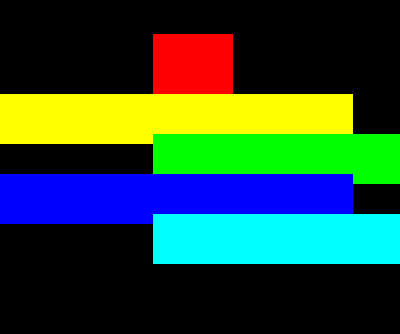
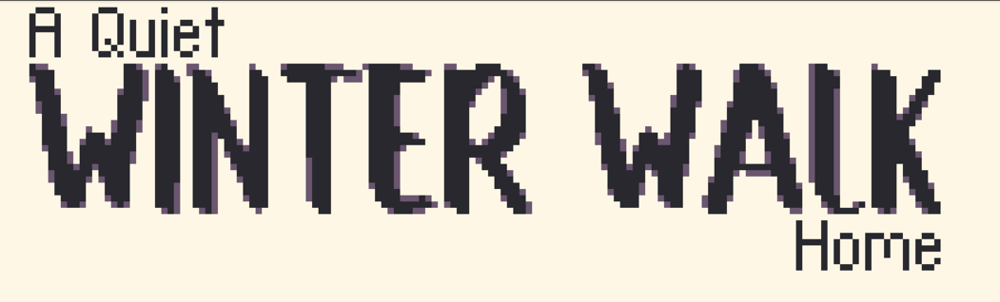

```
██████╗ ███████╗███████╗██████╗ 
██╔══██╗██╔════╝██╔════╝██╔══██╗
██║  ██║█████╗  █████╗  ██████╔╝
██║  ██║██╔══╝  ██╔══╝  ██╔═══╝ 
██████╔╝███████╗███████╗██║     
╚═════╝ ╚══════╝╚══════╝╚═╝     
```

**deep** is a tiny high-performance library that lets you add drawing layers and
a Z axis to any graphics framework in Lua. Insteaad of z-sorting your draw calls,
deep lets you keep a schedule which is executed in order.

## Usage
After placing `deep.lua` inside your project:

```lua
deep = require("deep")
layer = deep:new()

-- Queue actions. These actions can be drawcalls or anything at all.
layer:queue(3, function() print("wound!") end)
layer:queue(1, function() print("It's just") end)
layer:queue(2, function() print("a flesh") end)

-- Execute all actions in the layer
layer:draw()
```

This will print:
```
It's just
a flesh
wound!
```

## Documentation (just 3 functions)

### `deep:new()`

Returns a new drawing layer that holds its own queue of actions (its z-axis).
You can have multiple layers which get drawn one after the other, or not drawn at all:
```lua
background_layer = deep:new()
game_object_layer = deep:new()
ui_layer = deep:new()

function love.draw()
   -- Queue the actions for drawing stuff
   background_layer:queue(...)
   game_object_layer:queue(...)
   ui_layer:queue(...)

   -- With this, we will have the ui drawing over the game_objects.
   -- And both will be drawn in front of the background.
   background_layer:draw()
   game_object_layer:draw()
   ui_layer:draw()
end
```

### `layer:queue(z, fn)`
Queues a function for execution at index `z`, which **must** be an integer. It can
be negative, positive or zero. Using a float or any other type here will not
queue the action.

### `layer:draw(z_from, z_to)`
Executes all the queued functions for that layer in ascending Z order.

* When `z_from` and `z_to` are nil, all functions are executed.
* When either one of them is not nil, functions outside of the specified z
interval will be skipped. Both `z_from` and `z_to` are inclusive.


## Example


To achieve this, you could do the following: 
```lua
deep = require("deep")
layer = deep:new()

-- The z index of the red cube
current_z = 1

function love.draw()
   -- Queue the three horizontal lines
   layer:queue(2, function() draw_strip(200, 60) end)
   layer:queue(3, function() draw_strip(200, 80) end)
   layer:queue(4, function() draw_strip(200, 100) end)

   -- Red square, which can move through z axis
   layer:queue(current_z, function()
      -- Draws a red square
      love.graphics.setColor(1, 0, 0)
      love.graphics.rectangle("fill", 300, 40, 80, 80)
   end)

   -- Draw everything in the queue
   layer:draw()
end

-- Increases/decreases red square z on key press
function love.keypressed(key)
   if key == "up" then
      current_z = current_z + 1
   elseif key == "down" then
      current_z = current_z - 1
   end
end

-- Draws a horizontal white strip
function draw_strip(x, y)
   love.graphics.setColor(1, 1, 1)
   love.graphics.rectangle("fill", x, y, 300, 10)
end
```

## Movement example
The `example/` directory has a slightly more involved demonstration of deep.

Run `love example` from the root of this repository to get this:




## Games using deep

### Gnomber


Available on Steam: https://store.steampowered.com/app/2800770/Gnomber/


### Man Pit


Available on Steam: https://store.steampowered.com/app/2871950/Man_Pit/


### A Quiet Winter Walk Home


Available on itch.io: https://sysl.itch.io/a-quiet-winter-walk-home


### Shamen


Github source: https://github.com/nikaoto/shamen


### Disk Mayhem
Sourcehut source: https://sr.ht/~kikoodx/disk-mayhem/


## Possible speed optimizations
- Preallocate the queue with `table.new()` (only works in LuaJIT)
- Clear the queue on each exec with `table.clear()` (only works in LuaJIT)
